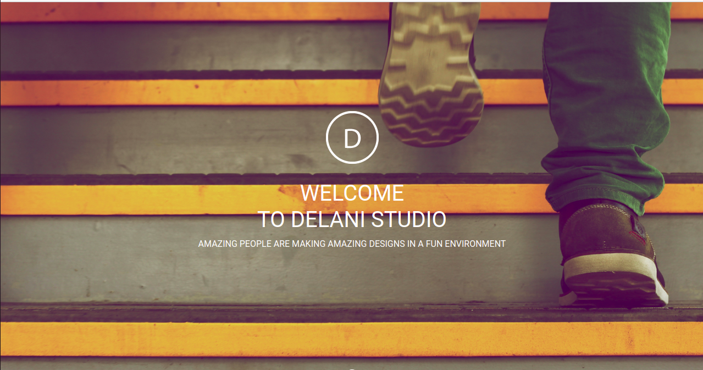

# Delani Studio
#### By Mary Njenga
### Site image

## Table of Content
+ [Description](#description)
+ [Behaviour Driven Development](#Behaviour-Driven-Development)
+ [Installation Requirement](#Installation)
+ [Design](#design)
+ [Technology Used](#technology-used)
+ [Licence](#licence)
+ [Authors Info](#author-Info)
## Description
 Delani studio is a project that shows details about the services the studio offers, has information about the studio, a portfolio section and a form that enables users to send their messages. 

****
## Behaviour Driven Development
| Behaviour      | Input     | Output     |
| :------------- | :----------: | -----------: |
|  Empty form    | User submits empty form | An error is message is displayed    |
|  Valid input    | User enters a valid details and submits    | A pop up that tells the user I have received their message is displayed |

****
## Installation
### Requirements
* A computer
* Access to the Internet
### Installation Process
* Lauch terminal
* To install Git, run the following command: sudo apt-get install git-all
* Run the command 'git clone https://github.com/mary-wan/Delani-Studio.git to clone the repository to your local computer.
### Live link
 Click on the link to view the site.https://mary-wan.github.io/Delani-Studio/
****
[Go Back to the top](#delani-Studio)
## Technology Used
* HTML - for page structure.
* CSS - which was used to style the pages.
* jquery -used for DOM

****
[Go Back to the top](#delani-Studio)
## Licence
MIT License

Copyright (c) 2021 Mary Njenga

Permission is hereby granted, free of charge, to any person obtaining a copy
of this software and associated documentation files (the "Software"), to deal
in the Software without restriction, including without limitation the rights
to use, copy, modify, merge, publish, distribute, sublicense, and/or sell
copies of the Software, and to permit persons to whom the Software is
furnished to do so, subject to the following conditions:

The above copyright notice and this permission notice shall be included in all
copies or substantial portions of the Software.

THE SOFTWARE IS PROVIDED "AS IS", WITHOUT WARRANTY OF ANY KIND, EXPRESS OR
IMPLIED, INCLUDING BUT NOT LIMITED TO THE WARRANTIES OF MERCHANTABILITY,
FITNESS FOR A PARTICULAR PURPOSE AND NONINFRINGEMENT. IN NO EVENT SHALL THE
AUTHORS OR COPYRIGHT HOLDERS BE LIABLE FOR ANY CLAIM, DAMAGES OR OTHER
LIABILITY, WHETHER IN AN ACTION OF CONTRACT, TORT OR OTHERWISE, ARISING FROM,
OUT OF OR IN CONNECTION WITH THE SOFTWARE OR THE USE OR OTHER DEALINGS IN THE
SOFTWARE.

****
[Go Back to the top](#delani-Studio)
## Authors Info
* Slack Profile - [Mary Njenga](https://app.slack.com/client/T077KKCG6/GLRQR61NW/user_profile/U027VKL1WLT?cdn_fallback=1)
* Email - [Mary Njenga](mary.njenga@student.moringaschool.com)

[Go Back to the top](#delani-Studio)